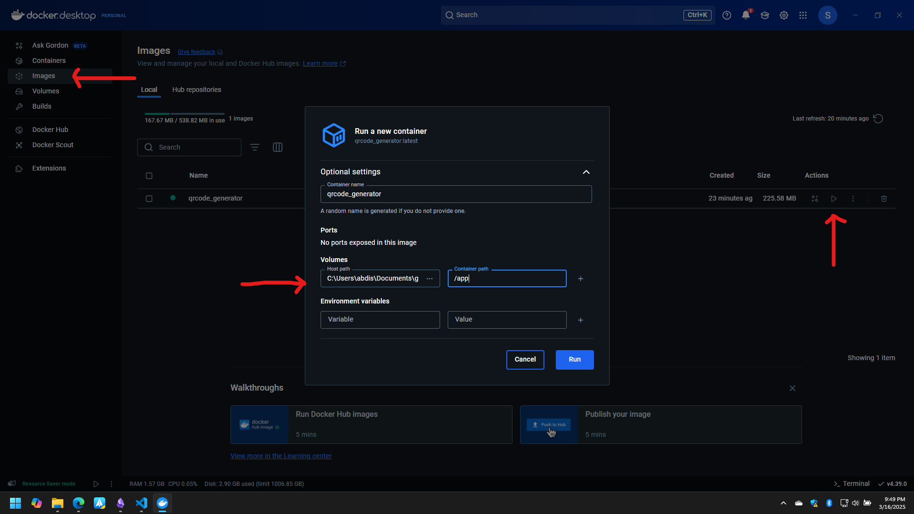

# Running a qrcode generator in docker

**This is a personal project that i used to remind myself basic docker commands.**

## How to run in cli

```bash

# clone this repo first

# Build the docker image
docker build -t qrcode_generator .

# Run the docker image
# Linux/Windows - Bash
docker run --rm -v "$(pwd -W)":/app qrcode-generator

# Windows - CMD
docker run --rm -v "%cd%":/app qrcode-generator
```

## How to run in docker desktop

first build the image using the command above.
Then run the image in docker desktop as shown in the picture below
Make sure to mount the volume to the /app directory in the container as shown below




## todo:

- [ ] Add a feature to generate a qr code directly from the cli
- [ ] Add a web service to host the qr code generator
- [ ] Add a serverless function to generate a qr code
